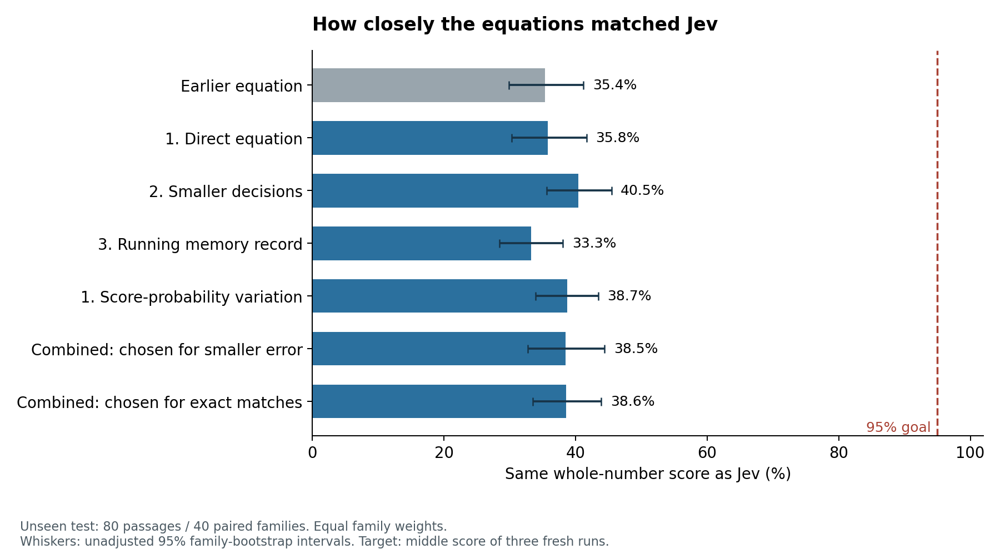
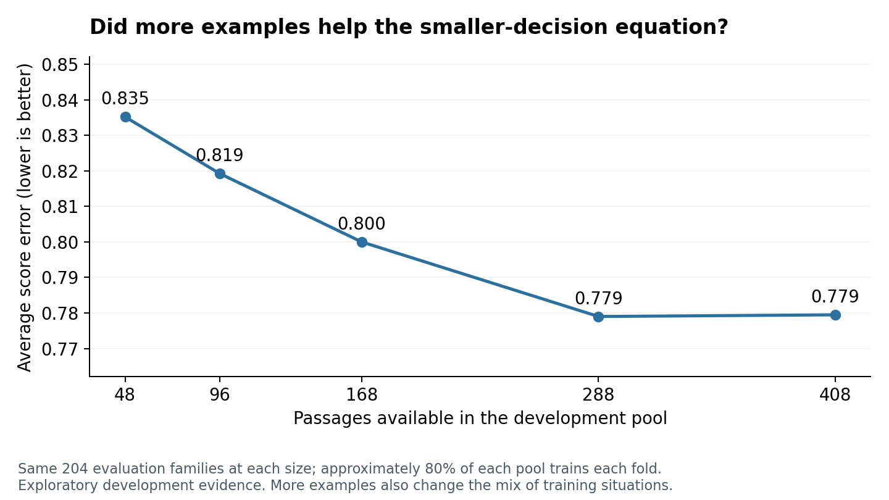

# Can a free equation reproduce the Working-Memory-Jev app’s scores?

**We built working offline equations. None of the six primary candidates met both original point-estimate targets.** On the fresh test, the highest observed whole-number agreement among the six primary candidates was **40.5%** (Smaller decisions, then count). The target was 95% agreement and average raw-output error of at most 0.10 score units.

The combination selected for smaller error **before** seeing the test answers matched 38.5% of scores, with average displayed-score error 0.734 and raw-output error 0.748. The highest observed test result is reported descriptively, not treated as a newly validated selection.

## What we did

Expanded development from 168 to 408 passages (204 paired scenario families; 2325 reading steps). We tried only the three authorized approaches: measure the text directly; predict smaller decisions and count them; or maintain an explicit running memory record. Word and grammar inputs, alternative counting rules, score-probability equations and one fixed shared combination were revisions within those approaches. We did not add a pretrained semantic model or route passages to specialist equations.

Before asking Jev for any final answers, we fixed all equations and saved all predictions. The separate test contained 80 passages, 40 families and 566 reading steps. Every step had three fresh reference scores; the middle score was the target. There were 0 missing final steps. The texts were separately authored and kept from fitting, but development and final scenarios shared one AI-assisted authoring process.

## The fresh-test results

| Method | Same whole-number score | Average displayed-score error | Average raw-output error |
|---|---:|---:|---:|
| Unchanged earlier equation | 35.4% | 0.802 | 0.808 |
| Word-count comparison | 31.2% | 0.863 | 0.888 |
| Direct equation | 35.8% | 0.815 | 0.840 |
| Smaller decisions, then count | 40.5% | 0.729 | 0.740 |
| Running memory record | 33.3% | 0.824 | 0.816 |
| Score-probability variation of approach 1 | 38.7% | 0.810 | 0.827 |
| Combination chosen for smaller error | 38.5% | 0.734 | 0.748 |
| Combination chosen for exact matches | 38.6% | 0.731 | 0.745 |

This table shows the six primary candidates and two baselines. The archive contains 14 base equations and 2 fixed combinations; [all model measurements](all-model-metrics.md) are reported descriptively. Secondary equations are not included in the six-comparison success claim.

All 16 frozen equations missed the original fidelity targets. The highest observed agreement across the full inventory was 43.0% for smaller decisions with lexical inputs. This secondary result is descriptive; choosing it after seeing this test does not validate it as the best equation for new passages.

An error of 0.7 means the score differs by 0.7 units on average; it is not a 70% error rate. Each scenario family has equal weight, and each step within that family has equal weight. “Same whole-number score” means agreement after half-up rounding; it does not require equality of fractional outputs. The probability variation reports its predicted median, while its raw value is the predicted mean.

## One concrete error

This illustration was chosen retrospectively from the largest errors of the combination selected for smaller development error. It is not a typical-error estimate or a new model-selection test.

> Apply the promise to this visitor.

The median of three Jev scores was **8**; the equation returned **3**. This shows a mismatch on this reading step; it does not identify why the equation made it. [Full passage, repeated scores and saved predictions](largest-errors.json).

## Did the new versions improve enough?

We specified a meaningful improvement as reducing average error by at least 0.10 against the unchanged earlier component equation. These six comparisons use paired family resampling and 99.1667% intervals, adjusted together to a nominal 95% familywise level. Positive differences favor the new equation. The intervals are approximate, not guarantees.

| New method | Error reduction | Adjusted interval | Test of at least0.10 improvement |
|---|---:|---|---|
| Direct equation | -0.013 | -0.130 to 0.109 | Unresolved |
| Smaller decisions, then count | 0.073 | 0.003 to 0.141 | Unresolved |
| Running memory record | -0.022 | -0.098 to 0.061 | Expected magnitude contradicted |
| Score-probability variation of approach 1 | -0.008 | -0.110 to 0.098 | Expected magnitude contradicted |
| Combination chosen for smaller error | 0.068 | -0.014 to 0.152 | Unresolved |
| Combination chosen for exact matches | 0.071 | -0.002 to 0.147 | Unresolved |

Contradicting the expected improvement is not necessarily evidence of no improvement. The adjusted intervals support some positive improvement for: Smaller decisions, then count. These main comparisons combine changes to data, measurements and fitting choices. Matched controls below help examine those explanations separately.

## What the extra data changed

| Same fitting method: 408 versus 168 development passages | Error reduction on the same fresh test | Unadjusted 95% interval |
|---|---:|---|
| Direct equation | 0.158 | 0.065 to 0.253 |
| Smaller decisions, then count | 0.127 | 0.073 to 0.184 |
| Running memory record | 0.065 | 0.007 to 0.123 |
| Score-probability variation of approach 1 | 0.188 | 0.100 to 0.277 |

These comparisons keep the fitting method fixed and relearn its numerical parameters from the larger sample. They are exploratory, specified before final answers but not included in the six-comparison adjustment. More data also changes the content, length and domain mix, so this does not isolate quantity alone. All ten secondary comparisons—including repaired ledger inputs, history, lexical inputs, actual grouping decisions and shared combinations—are in [secondary results](secondary-results.json).

Other revisions were less successful. Adding lexical inputs reduced error by 0.023 units, but its unadjusted 95% interval (−0.018 to 0.066) included no improvement. The grouping-choice variation increased error by 0.091 units (improvement interval −0.166 to −0.018). Keeping the running record’s history showed no clear advantage over clearing it. Neither fixed combination showed a clear advantage over the component equation selected during development. These exploratory comparisons preserve failed and uncertain ideas alongside the favorable results.

| Available development passages | Actual training passages per fold | Development error |
|---:|---:|---:|
| 48 | 36–42 | 0.835 |
| 96 | 68–84 | 0.819 |
| 168 | 128–144 | 0.800 |
| 288 | 228–234 | 0.779 |
| 408 | 326–328 | 0.779 |

## Why we also tested Jev itself

Two nonoverlapping random samples of 16 old scenario families received nine new analyses per passage. Dividing the scores into three nonoverlapping groups of three produced three fresh median targets. The table shows disagreement rates and unadjusted 95% family-bootstrap intervals. The first weighting matches the equation benchmark; the second was the original repeatability weighting.

| Study | Equal-family, equal-step disagreement | Equal-family, equal-passage disagreement |
|---|---|---|
| First 16 families | 13.4% (8.9%–19.2%) | 13.7% (9.0%–19.7%) |
| Next 16 families | 11.0% (5.4%–17.3%) | 11.1% (5.4%–17.6%) |
| Pooled 32 families | 12.2% (8.4%–16.4%) | 12.4% (8.5%–16.7%) |

**This does not establish that 95% accuracy is impossible.** The uncertainty does not rule out 95% expected agreement under either tested bound. The stronger calculation assumes repeated targets are independent and follow the same distribution for each fixed input. Its upper confidence endpoint is 95.69%. A bound is not an attainable optimum. These calculations do not assign all equation error to reference variability. See the [reference findings and assumptions](reference-findings.md).

One audited illustration used exactly the same camera-case passage and learner assumptions. Three separate groups of runs produced median targets of **2, 3 and 3** for its first sentence. A deterministic equation cannot perfectly replay all three recorded answers for identical input. This example was chosen after the study for illustration; it is not a future accuracy estimate or a contradiction of 95% feasibility. [Full context and all nine scores (in research-round3.zip)](https://github.com/AustinAWay/Equation-From-Jev-Research/releases/download/research-data-v2/research-round3.zip) are preserved.

A separate two-family diagnostic showed that changing which earlier ideas the app considers can change its scores. We kept the original capped procedure for the main experiment. This is evidence about the implementation, not a general law of human memory.

## A specific limit of the current measurements

A later development-data diagnostic found 57 pairs with identical direct-equation measurements but different recorded targets. Any deterministic calculation using only those measurements must miss at least one answer in each pair. However, the best possible fit to these particular recorded rows could still reach 98.02% agreement; this does not rule out the 95% goal. Reference variation and access to later text may contribute. The [diagnostic and its limits (in research-round3.zip)](https://github.com/AustinAWay/Equation-From-Jev-Research/releases/download/research-data-v2/research-round3.zip) preserve the examples and exact calculation. This check did not change any frozen equation.

## How this follows Popper’s approach

Each revision made a claim that could fail: extra text detail should reduce errors; retaining the running record should help beyond clearing its history; more examples should improve transfer; combining equations should exploit different mistakes. We kept failed candidates and counterexamples, fixed the final predictions before seeing answers, and tested the measurement process as well as the equations. The cleared-history control still parses the available prefix, so it does not remove every possible influence of earlier text.

A missed target challenges the specific performance claim being tested, under the stated measurement and sampling assumptions. We also check whether an implementation or reference-measurement problem could explain it. Failure does not prove that every possible equation must fail. Success on these examples would remain provisional. The family splits, bootstrap intervals and recorded freezes are modern safeguards for carrying out critical tests; they are not methods invented by Popper.

## What you can use

The **offline checker** contains the exact numerical equations and runs without Jev calls once its local dependencies are installed. The equations are long: fitted coefficients and piecewise decision rules are saved in readable JSON, alongside their input measurements and arithmetic. Equation length was not restricted. These are approximate predictors of a fixed app score, not validated measures of an individual student’s memory.

Read [the equation explanations](equations-explained.md), [checker instructions (in research-round3.zip)](https://github.com/AustinAWay/Equation-From-Jev-Research/releases/download/research-data-v2/research-round3.zip), and [research log](research-log.md). The full experiment archive preserves plans, all saved reference analyses, request and failed-attempt records, candidate results, source versions, audits, final predictions and costs. Reproducible worker caches are omitted with their hashes and regeneration instructions preserved.

The package was checked against the original fitted equations on development text, with network access blocked, including a relocated copy denied access to the source workspace and reference data. Before final calls, its raw-text segmentation was required to match the reference on all 80 final passages. Those checks establish faithful execution, not predictive accuracy. A separate [independent audit](independent-audit.json) recomputed the final measurements, checked every saved reference analysis, and verified that reference calls followed the saved predictions.

The detailed-input component equation also has a faster evaluator that follows the same tree decisions without repeatedly copying every input column. Its numeric parameters and counting rules are unchanged. Full-training native-versus-fast checks passed to numerical precision. Boundary cases and representative saved-equation comparisons separately check the original and faster evaluators against each other. The original full check also completed, and both runs produced byte-identical model files. Both sets of evidence are preserved.

## The next test worth running

A focused follow-up would add two clearly defined measurements: unfinished grammatical requirements and new information introduced between connected words. Compare otherwise identical equations on fresh matched examples. This proposal was developed after the current plan was frozen; it was not run in this experiment. Existing human reading studies motivate it but do not establish equivalence to the app score. The [short research appendix](literature-context.md) gives the evidence, contrary findings and outcomes that would challenge the proposal.

## Scope and costs

This test uses AI-authored English scenarios, a fixed grade-six reader profile, and the original app’s capped candidate procedure. It has no human performance measurements. Final reference repeats differed on 134/566 steps; 543 steps retained a provisional estimate in at least one repeat. Separately, 562 step rows inherited a passage-level coverage warning in at least one repeat. That passage flag does not show that each affected step individually failed. Forty families, shared authoring habits, and a partly confounded development length/domain mix limit generalization.

A provisional score still counts the app’s current groups and accepted extra connections, but some relationship decisions remain unresolved. It can change and is not a proven lower bound. A passage coverage warning can reflect limits such as checking only 12 earlier candidate ideas; it does not mean every step failed. We retained available tentative scores and required complete final scores. [The source audit explains these flags](reference-flag-meaning.md).

Round 3 reference usage: **$62.12** reported-token estimate; **$66.37** including retained reservations for unknown usage. Across all rounds: **$75.41** reported-token estimate. These are reference-service estimates, not invoices, and exclude development-tool usage and local computation. Detailed ledgers are preserved.

Sources: [Working-Memory-Jev repository](https://github.com/AustinAWay/Working-Memory-Jev), [Popper: Science as Falsification](https://tildesites.bowdoin.edu/~j.knockel/falsification/). All numerical results above come from the saved experiment, not those external sources.
