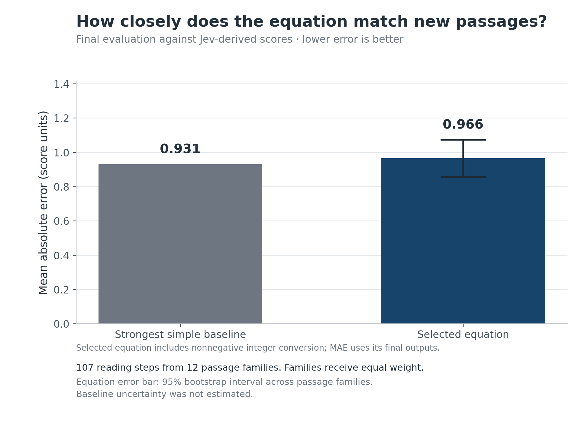
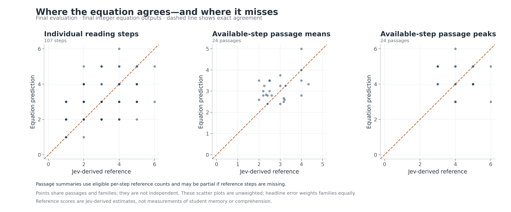

# Working-memory equation: completed pilot

**Research question:** Can we discover a mathematical equation, of any length or complexity, that reproduces Passage’s Jev-based working-memory demand scores on passages it has never seen?

**Outcome:** The selected local equation **did not meet the proposed targets in this held-out pilot**. On 12 unseen passage families, it matched 31.2% of displayed Jev-based step scores and missed by 0.966 units on average. The targets were at least 95.0% agreement and no more than 0.1 units of mean error, while beating a simple baseline.

This tests agreement with Passage’s Jev-based estimates. It does not measure students’ working memory or establish cognitive validity.

## Final result

| Measure | Selected equation | Strongest simple baseline |
|---|---:|---:|
| Displayed scores matching | 31.2% | 26.4% |
| Mean absolute error, units | 0.966 | 0.931 |
| Error within one unit | 74.7% | 82.1% |

The baseline was **Integer-output word-count equation**, chosen using development results before opening the final test. The equation's error improvement was -0.035 units; its paired 95% family-bootstrap interval was -0.144–0.076. A negative improvement means the baseline performed better.

The 95% family-bootstrap intervals were **24.1%–38.9%** for exact agreement and **0.857–1.073 units** for mean error. Families receive equal weight, so families with more clauses cannot dominate the result. Resampling whole families preserves related examples together; these intervals describe this small test set, not all possible text.

The paired interval includes zero: this test does not clearly distinguish the measured advantage from no advantage.

Before its explicit integer-output wrapper, the same base equation had mean error 0.952 and displayed agreement 31.2%. The headline error belongs to the final integer-valued equation; the two are reported separately.

The original 0.1-unit unrounded-error target is checked against the continuous base as well, so adding rounding cannot turn a failure of that target into a success.

## What was tested

The corpus contained 120 AI-authored short English passages in 60 families, with two related variants per family. Science, history, practical instructions and everyday situations were included. Passages were 38–47 words long. Related variants stayed together in one partition.

| Partition | Planned passages / families | Eligible reading steps / families |
|---|---:|---:|
| Train | 72 / 36 | 331 / 36 |
| Validation | 24 / 12 | 106 / 12 |
| Test | 24 / 12 | 107 / 12 |

The reader was fixed at grade 6 with visible text. The task was: “Explain the main idea or instructions and apply them to a similar example.” Prior knowledge: The learner knows ordinary English, common everyday objects and actions, and basic whole-number arithmetic. Do not assume previously learned specialist terminology or subject-specific mechanisms unless introduced in the passage. The app’s scenario budget was 4; it was not a measured student capacity.

Each reference step used the middle score from three full analyses. A step entered fitting/evaluation only when all required runs supplied a valid count. Missing counts were never changed to zero. Provisional numeric estimates stayed in the dataset with their flags.

All reference data recorded 544 eligible steps out of 544 observed; 0 were ineligible, 520 were flagged provisional, and 447 had limited coverage. 155 steps had differing repeat scores.

Pairwise agreement between repeat reference runs was 80.1% with equal family weighting. This describes reference variability; it is not a hard ceiling on matching the three-run median.

Within the 107 eligible final-test steps, 102 were provisional and 68 had limited coverage. Unavailable reference steps are outside the accuracy denominator.

## How the equation was developed

1. Collect real scores using the frozen application and preserve the full analyses.
2. Measure text locally: length, grammar, earlier mentions, connections and action cues.
3. Fit equations, inspect development errors, record a proposed explanation, and test revisions.
4. Compare candidates on reserved development families, then freeze the equation and simple comparator.
5. Evaluate once on the untouched final families. Record the outcome even when targets are missed.

An early engineering pilot used 64 reading steps from 7 permanent-training families, with 2 temporarily reserved for error inspection. Those cases were development material throughout. Across 77 configurations evaluated in both versions, the best mean error improved from 0.633 to 0.481 units. Rerunning the original winning configuration itself gave 0.698. The registered revision added 20 generic measurements of actions and their objects, such as comparing, arranging, connecting and manipulating. The hypothesis was that instructions and descriptions can demand different relationships even at similar lengths. This pilot comparison tests that feature revision locally; it is not a fresh final test or proof of a cognitive mechanism.

A later development snapshot contained 207 reading steps. Its best recorded candidate had validation mean error 0.552 and displayed agreement 51.4%; training mean error was 0.020. This separates fitting known examples from carrying performance to other families. The next recorded hypothesis added distinctions between common logical/reference words and locally stored word-frequency measures. Those were proxies for relationships and familiarity, not Jev-derived features. Across 81 matched continuous configurations, the best mean error changed from 0.607 to 0.616 units. Across 81 matched integer-output configurations, the best mean error changed from 0.552 to 0.540 units. These comparisons used the same development snapshot; the final test stayed separate.

The final feature/data version has **540 distinct successfully evaluated candidate configurations** across 540 successful evaluation records; 270 configurations are explicit integer-output variants. No equation-length penalty was imposed. The best result within each recorded search stage follows; these are development results, not extra final tests.

| Search stage | Best candidate | Validation mean error | Displayed agreement |
|---|---|---:|---:|
| Simple and additive equations | `readability_baseline` | 0.698 | 40.7% |
| Interactions, curves and conditional equations | `RandomForestRegressor_leaf2` | 0.643 | 46.3% |
| Direct arithmetic-expression searches | `symbolic_seed23` | 0.726 | 38.1% |
| Earlier measurement versions on the full dataset | `v1_boosted_absolute_error_depth2_n100` | 0.639 | 46.2% |
| Explicit integer-output equations | `rounded_v1_boosted_absolute_error_depth5_n400` | 0.587 | 49.2% |

The 9 completed direct expression searches recorded 30, 30, 30, 30, 30, 30, 30, 30, 30 generations respectively. Internal mutations are search steps, not independently validated models.

## The resulting equation

Selected candidate: `rounded_v1_boosted_absolute_error_depth5_n400`. The selected equation is a weighted sum of 400 conditional equations. Each condition compares a measured text property with a fixed threshold, fitted with 231 available input measurements. The saved evaluator preserves the fitted model’s 32-bit input conversion at branch comparisons. Rounding and the zero floor are explicit parts of this candidate equation. 

```text
base(x) = 3 + Σᵢ₌₁…400 (0.03 × Tᵢ(x))
score(x) = max(0, floor(base(x) + 0.5))
```

Every coefficient and condition is in [the full equation (in research-round1.zip)](https://github.com/AustinAWay/Equation-From-Jev-Research/releases/download/research-data-v2/research-round1.zip); [the machine-readable equation (in research-round1.zip)](https://github.com/AustinAWay/Equation-From-Jev-Research/releases/download/research-data-v2/research-round1.zip) preserves its exact structure. After installation, text measurement and equation evaluation run locally without Jev calls. Parsing uses a downloaded language model; familiarity proxies use the local wordfreq 3.1.1 tables. Neither requires an API call during checking. Local measurements use the text prefix through each step; Passage’s local full-text parser determines the reading-step boundaries.

## Reproducibility, cost and limits

The reference source commit was `cee3edb9922115d759778434878f6c56b483b390`, model `jev-1.13.0`, prompt `passage-2026-09-21.2`, with 2 internal samples per question. Caches bind the corpus, profile and application version; fitted candidates bind the development labels and feature implementation. Export checks compare the saved mathematical evaluator with fitted-model predictions.

Provider-reported input usage corresponds to **$9.8726** at the configured rate of $0.042 per million input tokens. The ledger contains 33,430 HTTP requests and 4 with unknown usage. Charged-or-reserved accounting totals $9.9609 against the $15.00 ceiling. This is usage-based accounting, not a reconciled invoice.

The final test covered only 12 families from a small, synthetic, narrowly sized corpus. It cannot establish performance on long lessons, other languages, different readers or human outcomes. Repeated development comparisons can overfit the validation set; only the final comparison estimates unseen-family performance. Jev’s scores also contain uncertainty and variation.

Missing the targets shows this search did not find the required equation under these conditions. It does not show that a better equation is impossible. The next study should expand independently sourced passages and investigate remaining errors, then use a new untouched final set.

See the [decision and reasoning log](research_log.md), [reference-quality audit](reference-report.json), and [complete reproducible experiment (in research-round1.zip)](https://github.com/AustinAWay/Equation-From-Jev-Research/releases/download/research-data-v2/research-round1.zip) for the detailed record.

## Visual results





See [the failure analysis](failure_analysis.md) and [offline checker instructions](README.md).
